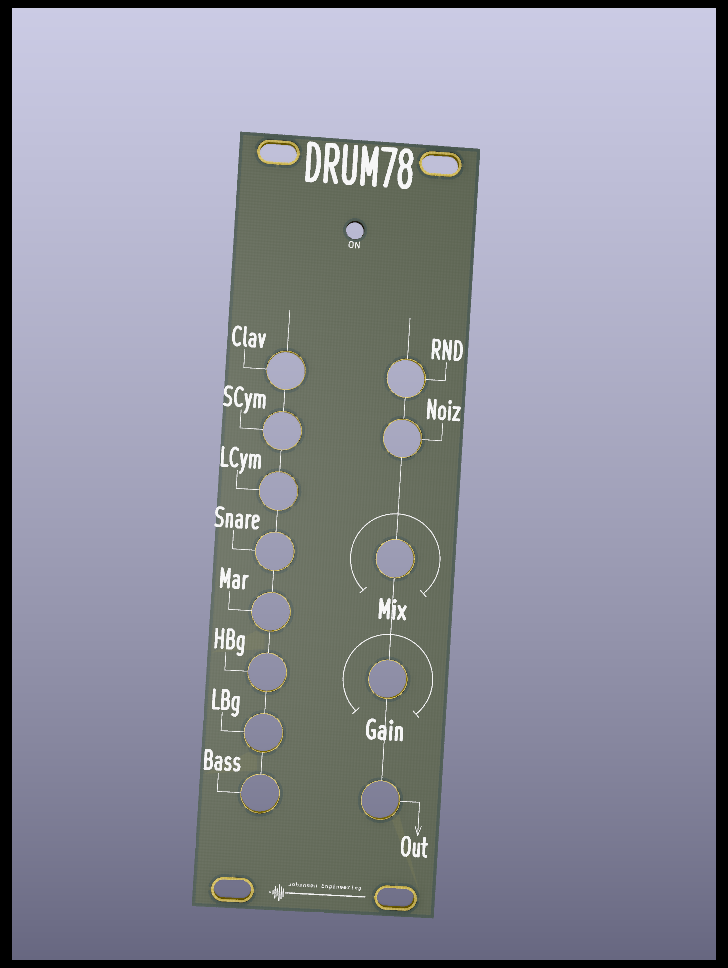
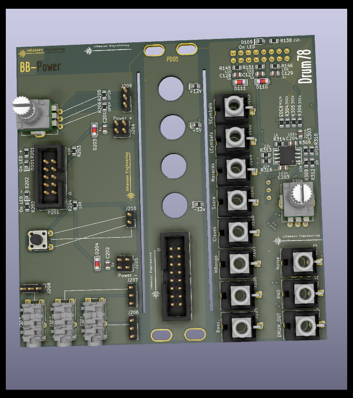
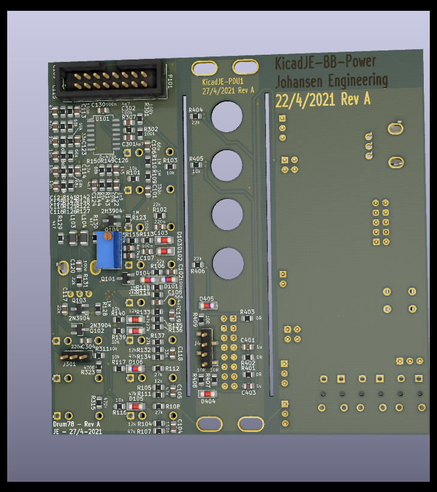
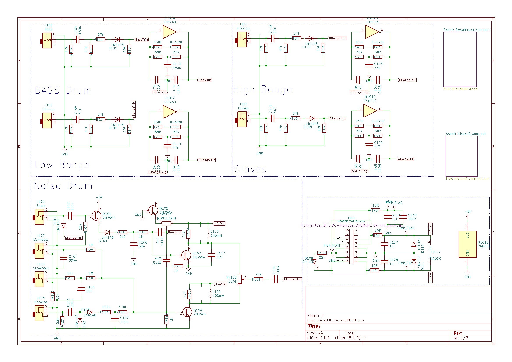

# KicadJE_PE_1978-01_Drum
Based on https://worldradiohistory.com/UK/Practical-Electronics/70s/Practical-Electronics-1978-01.pdf

# Purpose

## Board 1 - Drum module
Adjustment:  
Mix of snare amt

Gate Input:  
TTL Square

Output Audio:  
+/- 10V AC coupled

## Board 2 - Breadboard helper
Testing out text prints

Adjustment:  
100k Pot to pinheader  
Push button to pinheader

Input/Output:  
3,5mm jack to pinheader  
+-12V from Eurorack 10pin IDC to breadboard pinheaders

## Board 3 - Desktop PDU for Eurojack
Banana jack in  
16 pin Euro power out

# Status - Being assembled
## Initial 
| Stage  | Detail | Status |
| ------------- | ------------- | ------------- |
| create material  | sch | done |
| | pcb | done |
| | gerber | done |
| production  |   | delivered |
|  | produced | delivered |
|  | delivered | ok |
## Preliminary validation
| Test  | Detail | Status |
| ------------- | ------------- | ------------- |
| Initial Inspection | PSU | ok |
| Initial Inspection | BB Helper | ok - Solder-mask-expansion on copper looks best - better than silk |
| Initial Inspection | Drum Module |  |
| Initial Technical Test | Board 1 |  |
| Initial Product Test | Board1 |  |

## Secondary validation
| Test  | Detail | Status |
| ------------- | ------------- |------------- |
| Product Test | 1 | |
| Quality | 1 | |
| Long Term Product Test |  |  |
| Power Draw |  | 

## Errata
### Errata - 

## Issues and Notes
### 

# Pictures

# Schematic
## Sch 1

# Analysis
## Diag 1

https://worldradiohistory.com/UK/Practical-Electronics/70s/Practical-Electronics-1978-01.pdf

## Prototype

